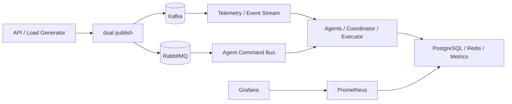

# CloudRM: исследовательский прототип мультиагентного управления ресурсами ЦОД

Прототип моделирует событийно-ориентированную систему управления очередями задач и вычислительными ресурсами облачного дата-центра. Kafka используется как потоковая шина событий и телеметрии, RabbitMQ используется как оперативная шина межагентных команд и маршрутизации. Состояние хранится в PostgreSQL и Redis, метрики собирает Prometheus, панели автоматически загружает Grafana.

## Быстрый запуск

```bash
make init
python scripts/check_compose.py
docker compose up --build -d
docker compose ps
```

Проверка:

```bash
python scripts/validate_infra.py
curl http://localhost:8000/health
```

Полная runtime-проверка после запуска всех контейнеров:

```bash
python scripts/validate_brokers.py
python scripts/validate_runtime.py
RUN_INTEGRATION=1 pytest -q tests/integration
```

## Исправление ошибки `project name must not be empty`

Если команда:

```bash
docker compose up --build -d
```

падает с ошибкой `project name must not be empty`, значит Docker Compose получил пустое имя проекта. Обычно причина в пустой переменной `COMPOSE_PROJECT_NAME` или `PROJECT_NAME` в окружении или `.env`.

В проекте задан безопасный fallback:

```yaml
name: ${COMPOSE_PROJECT_NAME:-ahmed_cloud_mas}
```

В `.env` должно быть:

```bash
COMPOSE_PROJECT_NAME=ahmed_cloud_mas
```

Команды диагностики и исправления:

```bash
make init
python scripts/check_compose.py
docker compose config
docker compose up --build -d
python scripts/validate_runtime.py
```

Если `python scripts/check_compose.py` сообщает, что Docker CLI не найден, нужно запустить Docker Desktop или установить совместимый Docker CLI.

## Архитектура



## Kafka и RabbitMQ

Kafka сохранен как долговременная потоковая шина событий, телеметрии и аудита. Все исходные топики остаются активными: `request.created`, `request.classified`, `need_placement`, `node.proposal.fit`, `sla.risk`, `forecast.queue`, `decision.dispatch`, `decision.scale`, `execution.done`, `execution.failed`.

RabbitMQ добавлен как оперативная шина межагентного обмена. Он использует topic exchange `mas.events`, DLX `mas.dlx`, retry exchange `mas.retry`, очереди `queue.requests`, `queue.resources`, `queue.sla`, `queue.forecast`, `queue.coordinator`, `queue.executor`, `queue.dead` и `queue.retry`.

В текущем инкременте используется гибридный режим `dual-publish`: важное доменное событие публикуется в Kafka и дополнительно в RabbitMQ с тем же `correlation_id`. `event_id` остается общим для доменного события, а `message_id` генерируется отдельно для каждой брокерной публикации. Это сохраняет текущую Kafka-реализацию и добавляет RabbitMQ-модель из ВКР без рискованного переключения потребителей.

Ссылки после запуска:

- API: http://localhost:8000
- RabbitMQ Management UI: http://localhost:15672
- RabbitMQ логин/пароль: значения `RABBITMQ_DEFAULT_USER` и `RABBITMQ_DEFAULT_PASS` из `.env`
- Prometheus: http://localhost:9090
- Grafana: http://localhost:3000

## Текущий статус

[✓] Добавлены Kafka, RabbitMQ, PostgreSQL, Redis, API, Prometheus, Grafana  
[✓] API умеет принимать задачи и публиковать `request.created` в Kafka и RabbitMQ  
[✓] Реализованы `queue-agent`, `resource-agent`, `sla-agent`, `forecast-agent`, `coordinator-agent`, `executor-agent`, `load-generator`  
[✓] Добавлены healthcheck endpoints и Prometheus metrics endpoints для всех Python-сервисов  
[✓] Добавлены smoke-тесты, интеграционный тест полного потока и runtime-валидатор  
[ ] Полная контейнерная проверка требует ручного запуска `docker compose up --build -d`  

## Сервисы

| Сервис | Порт | Назначение |
| --- | ---: | --- |
| `api-service` | 8000 | Прием задач, статус задач, эксперименты, отказ узла |
| `queue-agent` | 8011 | Классификация задач, динамический приоритет, очередь |
| `resource-agent` | 8012 | Проверка ресурсов узлов и предложения размещения |
| `sla-agent` | 8013 | Оценка SLA-риска и повышение приоритета |
| `forecast-agent` | 8014 | Скользящий прогноз очереди |
| `coordinator-agent` | 8015 | Выбор узла по utility-функции и fallback scale-out |
| `executor-agent` | 8016 | Эмуляция Kubernetes-исполнения |
| `load-generator` | 8017 | Сценарии нагрузки |
| `rabbitmq` | 5672 / 15672 | Оперативная шина команд и Management UI |
| `prometheus` | 9090 | Сбор метрик |
| `grafana` | 3000 | Панели мониторинга |

## Kafka topics

`request.created`, `request.classified`, `need_placement`, `node.proposal.fit`, `sla.risk`, `forecast.queue`, `decision.dispatch`, `decision.scale`, `execution.done`, `execution.failed`.

## Пример API

```bash
curl -X POST http://localhost:8000/tasks \
  -H 'Content-Type: application/json' \
  -d '{"task_type":"batch","cpu_required":2,"ram_required_mb":1024,"duration_seconds":5,"priority":3,"sla_deadline_seconds":30}'
```

```bash
curl http://localhost:8000/nodes
```

Запуск эксперимента:

```bash
curl -X POST http://localhost:8000/experiments/start \
  -H 'Content-Type: application/json' \
  -d '{"scenario":"overload"}'
```

Остановка эксперимента:

```bash
curl -X POST http://localhost:8000/experiments/stop
```

Симуляция отказа узла:

```bash
curl -X POST http://localhost:8000/nodes/node-a/failure
```

## Проверки

```bash
pytest -q
python scripts/validate_env.py
python scripts/check_compose.py
docker compose config
docker compose up --build -d
docker compose ps
python scripts/validate_brokers.py
python scripts/validate_runtime.py
docker compose logs -f --tail=200
```

## Ограничения

Прототип не является реальным Kubernetes-оператором и не выполняет фактическое облачное autoscaling-действие. `executor-agent` использует эмулятор исполнения через `asyncio.sleep`, а `coordinator-agent` публикует рекомендацию `decision.scale` как исследовательский сигнал.
